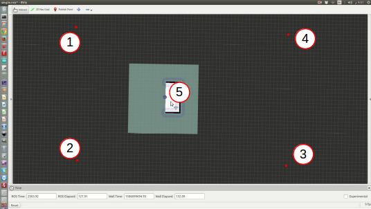

# RoboBreizh Navigation Package

## 1. Installation

Execute the provided installation script:

```buildoutcfg
bash ./install.sh
```

## 2. Usage

To perfrom mapping and navigation we assume that you already successfuly launch one simulated environment (with Gazebo).

### 2.1. Mapping 
To perform mapping in one of the environment do (you should have the simulation running beforehand):

```buildoutcfg
source devel/setup.bash
roscd navigation
chmod +x ./mapping.sh && ./mapping.sh
```

You will be able to choose between 4 different mapping modes: 
1. the first one use a frontier-based autonomous exploration to generate a 2D map of the environment 
2. the second also uses a frontier-based autonomous exporation but generates a 3D mapping of the environment using octomap package and the depth camera 
3. the third will launch a teleoperation tool for you to drive the robot around manually (using the keyboard).

#### Saving map

Once you are satisfied with the generated map you might want to save it.

Save rrt 2d map :

    rosrun map_server map_saver -f lasermap map:=/map
Save octomap 3d projected map :
    
    rosrun map_server map_saver -f octomap_projection map:=/projected_map
Save octomap 3d map :
    
    rosrun octomap_server octomap_saver -f mapfile.bt

#### Frontier-based Exploration: [package rrt_exploration](http://wiki.ros.org/rrt_exploration)

If you choose the option 1 or 2 for mapping you need to configure the frontier-based algorithm. First wait that all the windows (Rviz + 2 terminals) are launch and that you have "the map and global costmaps are received" message in the second terminal.
Then, in the Rviz window, you can publish 5 different points (using publish point tool): the 4 first ones will be for the size of the map that you want. The last one is the first goal for the robot and should be in the already mapped area (in white area in Rviz) while the others can be anywhere else.

!!! BE CAREFUL !!! You shouldd respect the following order for the points (left-top, left-bottom, right-bottom, right-top and goal) instead nothing will work:



#### Mapping with Octomap: [package octomap](http://wiki.ros.org/octomap)

**Warning :** 
If you start mapping with octomap and nothing shows up in, you need to restart the script (1 or 2 times). 

To do so, close the 2 terminals and Rviz that has been launch with ```./mapping.sh``` then open a new terminal and start over.

### 2.2. Navigation

The navigation is performed through the [ROS Navigation Stack](http://wiki.ros.org/navigation). If you are using the robocup environment you can launch the navigation easily:

```buildoutcfg
source devel/setup.bash
roscd navigation
chmod +x ./navigation.sh && ./navigation.sh
```
A message will prompt and ask you to choose a map path, either a predefined one using numbers or the full path of your map file (.yaml). 

This will open Rviz and you can give goal orders to the robot using the 2D nav goal tool.

Wait until you can see pointcloud on some black area to start navigation.

To navigate use the 2d nav goal tool. Left-click on to chose the goal, hold it to chose final orientation.

If you used your own path then when you'll see Rviz window you will need to define the initial position of the robot using the 2D pose estimate tool.

**Warnings :**
Some warnings might appear but you shouldn't be worried about those such as :
```bash
[ WARN] [1620804253.232354731, 1231.068000000]: Costmap2DROS transform timeout. Current time: 1231.0680, global_pose stamp: 1230.5130, tolerance: 0.5000
[ WARN] [1620804253.232482637, 1231.068000000]: Could not get robot pose, cancelling reconfiguration
```
#### More on teb local planner : [package teb_local_planner](http://wiki.ros.org/teb_local_planner)
If you want to get familiar with the package, i'd recommand doing the tutorial provided.

To adjust the parameters of teb local planner you can use the ros tool rqt_reconfigure using :
```bash
rosrun rqt_reconfigure rqt_reconfigure
```
**Warnings :**
Sometimes the moving object would collide with the robot, it has hard time predicting moving element trajectory.
Sometimes the robot trajectory won't be curved enough ending in the incapability to properly reach the goal.

## 3. Description

This package allows different kind of mapping the environment as well as navigation following a generated map.

### 3.1 Mapping

#### 3.1.1 2D mapping

The 2D mapping is done using pepper lidar.
The lidar information is sent to a Gmapping node to generate a map.

The problem with this method is that it is not possible for the robot to map the tables for example because only the elements close to the ground are detected.

**WARNING :**
you must change map topic in rrt simple.launch for it to work

#### 3.1.2 3D mapping

The 3D mapping is done with the pepper depth camera.
This one generates a point cloud (pointCloud) which is then processed by an octomap_server node.
Octomap allows you to generate a map of voxels (pixels in a 3d space) and generate a map.

By default every obstacle is represented but you can filter them using the node parameters. 
```xml
<!-- avoid creating voxels for the ground -->
<param name="filter_ground" value="true" />
<!-- avoid rendering voxel above this height -->
<param name="occupancy_max_z" value="1.6" />
```
This is useful for using a projected map of the voxel map.

### 3.2 Navigation

In the navigation script you can start teb navigation which allows the robot to avoid obstacles while navigating. It is a layer on top of ros navigation stack.